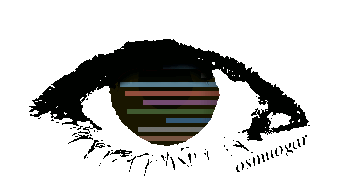

### Hello there! 👋

#### I like to define myself as a professional computer scientist
- 🔭 I’m currently working as 🧪 researcher 📖 at UPV
- 🌱 I’m currently studying a PhD in distributed systems
- 💬 Ask me about scalability
- 📫 You can reach me by my [linkedin profile](https://www.linkedin.com/in/oscar-mu%C3%B1oz-garrigos/)

[comment]: <> (- 👯 I’m looking to collaborate on ...)
[comment]: <> (- 🤔 I’m looking for help with ...)
[comment]: <> (- 😄 Pronouns: ...)
[comment]: <> (- ⚡ Fun fact: ...)

#### Favorite technologies

